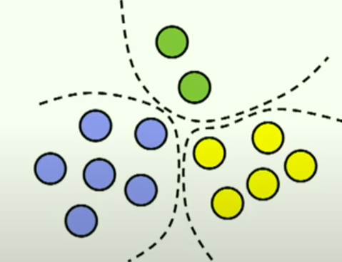

# Reseliance PatternsMust Know Building Microservices :
 

## Distributed-System Defenition
  * A distributed system is one in which the failure of a computer you didn't even know existed, can render your own computer unusable.

## If your system can't withstand production you're doomed:
  * if your business idea can't be mapped into a system available at least 99% then the system we built is useless. customers will run away.
  * $availability = upTime/totalTime =  \frac{\bar{\text{meanTimeToFailure}}}{\bar{\text{meanTimeToFailure}} + \bar{\text{meanTimeToRecovery}}}$

##  Key Things to Do to Mitigate Failure:
  * write more tests: unit-tests, end-to-end, as well as (load-test, spike, resilience, [ToxyProxy_tool_to_delay_traffic_between_services_for_testing](https://github.com/Shopify/toxiproxy/blob/main/README.md) )
  * try to recover from failure as fast as you can, we want to have a detection mechanism and ways we can backup as soon as possible.
___
___

## Resilience patterns:
 * **What is a Resilient System**:(trying to do your best not to show the failure) is the ability of a system to handle **unexpected** situations `without users noticing`(best-case), or with a `graceful degradation` of service.
 ### Example of Graceful degradation (Read-problems) :
  - **Problem1**: trying to retrieve data from a system that is down ==> you could serve an older value and hope nothing can go wrong importance of caching.
  - **Problem2**: can't access user recommendation ==> return lower quality as recommendation per country, city, or gender better than nothing.
  - **Problem3**: search optimiser not working ==> call a slower system, for example, search in sqlDb when ElasticSearch is down better than nothing.
  - **Problem4**: can't send result immediately ==> notify by we will send you the result later in an email when we're done.
### Example of Graceful degradation (Write-problems) :
 - **Problem5**: command to change data.
 - sol 1: **outbox table pattern**: insert it in DB of the caller service the request + schedule a persistant retly until successful
 - sol 2: **send it as message**: instead of HTTP use asynchronous MQ approach and the system will handle it when available (handle end-user retry gracefully)
 - sol 3: **Log an ERROR**: at least log an error, that raises the alarm calling for manual intervention.
     - sol 3: **Case: too frequent Errors**: send an error event to `supervisor for automatic Recovery([saga pattern]())`.
***
***
***
## Patterns we will study :

---
## Isolation (importance of foreseeing potential errors):
 ### Catastrophic Failures Examples :
  - Ex1 : **Long Chain of REST calls** : A->B->C->D->E (anything can go wrong in this chain)
    - any failure can blow up the whole thing.
    - any delay in this processing can delay all the upstream systems
    -  => its a terrible fragile architecture (simply a distributed monolith architecture)
  - Ex2 : **A request causes the instance to restart**:  and client keeps retrying or refreshing.
  - Ex3 : **A poison pill case MessageQueue**: receiving some type of particular message that causes the listener to crash.
     - and that message is retried again and agian not only just crushing your listener once .
     - => Freeze the entire stream of messages 
  - Ex4 : **Undounded Queues**: running of (disk-space/RAM) in messageBroker, instance crashes with outOfMemoryError.
     - reasons:
       - Not monitoring the size of their topics(Kafka-case)
       - No Alarms when 10 billion  of messages on the queues
       - => publishers and consumers services relies on the the brokers will fail as well.
  - Ex5 : **Concurrent Massive DB Import/Export overloads the DB**: end-users running db heavy import-export operation that takes too long and keep refreshing
     - => result on concurrent heavy operations that exhaust the database .
     - ==> its very important to introduce boundaries around parts of your system.
 ### Introducing Boundaries `BulkHead (aka Failure Units)`:
  #### Core Isolation pattern :
   - **Pure Design issue**: what should be independent of what ?
   
   - **1st** we need to identify the pieces in our architecture that should still work, even if other parts on our system are down .
   - **2nd** you should draw these lines and say whatever in green should not depend on stuff on blue or yellow.
   - **3rd** if the blue has to work reasanbly without the green ones , you would have to `cache(replicate) some data` of the green one to survive them being down (`use these boundaries as boundaries of redundancy`).
   - **4th** use the bundaries as **units of scale** enough to scale up that bubble and not every single service.
    
 ### Isolating Bulkhead Examples:     
  - by **Key Features**: catalog , search, checkout
    - The catalog could be down, but users can still search   and check out  products from their cart.
  - by **Markets|Region**:
    - deploy the same product in different countries, if you lose Romania you can still save France.
  - by **Tenants**:
    - if you develop cloud solutions to have your clients not influencing each other, having a VIP tenant should not fail if your regular customers are growing in numbers.
 ### To isolate them you Can Use:
  - **(connection|thread) pools**:
    - **within the** same application: first level, you could use different connections and thread pools, different resources within the same application.
  - **Application Instances**:
    - second level, deploy completely different application instances one process could fail the other could still work.
  - **Databases, Queues**:
    - next-level, will be to fully separate down to database and messaging infrastructure to have completely separated resources involved in each of the bulkheads. Depending on how much you want to invest in this and how and where do you see the failures you can go deeper or not.
---
### `Throttling`:
 - throttling means you need to put an artificial limit to the amount of load the server could take.
 - **why limiting the Load** on a server:
   - **Prevent crash** We prefer to see `503 service unavailable better than outOfMemoryError` .
   - **Prevent Long ResponseTime** we prefer to have an error in 30second then success withing 1 minute , end user may consider it a failure and retry and overwhelm the service more with the same request that is already processed, and to make it worse if method called is not idempotence then dister will happens (time-response is based on context).
   - **Protect critical endpoints** services are not allowed to impact more important critical services endpoints.
     - ex: export invoices service that the secretary is running is **not allowed to impact the place order endpoint** you want to give more priority to the order service because its business-critical.
     - **ensure fairness** return 429ToManyRequestStatus to greedy clients/tenants to tell that client to backOff and lower their rate of call.
     - **Limit auto-scaling to fit the budget** of scaling on a cloud provider or your private cloud.
       
 - #### what to throttle, basically those 3:
   - **Request Rate** number of request/second , ex max 300 requests/seconds, eg via @RateLimiter
   - **Concurrency** number of requests that happen at the same-time(parallel), ex max 3 exports in parallel, eg via @BulkHead .
   - **Stuff that directly costs you** :
     - **Traffic** max 1Gb/minute .
     - **Resource units if you're in a cloud environment**  max 300 credits/minute.
 - #### Where to throttle these:
   - globally
   - per client
   - per endpoint
- #### example of throttling features :
   -  
   - Feature A critical (untouched) business-critical can't be degraded.
   - feature C needed (but degraded) to give some extra space to feature A.
   - feature D (stopped completely) to leave its resource utilization to both A and C, so the system won't freeze/crash when reaching maximum capacity (case resource limitation/budget-tight).
   - ps: must consider optimization problems like linear programming to calculate the degradation rate in the pick of feature A.
     
- #### facing a lot of Usage Spikes:
  - you usage pattern looks like this: 
  - ==> bulks of requests coming and being paged to you like 1000req/sec how do you survive?
  - **First all Engineers must Understand** is the performance response curve.
    - 
    - **throughput**: is the number of requests that can be successfully handled per unit per time.
    - **concurrent requests single machine** the number of concurrent requests that start executing in a single machine.
    - => the more pressure u put on a machine at some point you re going to see `degradation of response time` --> u gonna see slowing down of the entire speed of that system.
      - why? because you will have:
        - Memory issues
        - Compete on processor
        - `kill the database` the database will also be affected since too many write requests concurently can occure especially if ACID will increase response time.
     - **solutions**
       - **1-degradation-ok** `identity load too high` and enqueue some of it to assure no failure but degradation in response-time is ok and does not matter ==> ex [0 --> safeNotToCrush]
       - **2-Critical-responseTime** Identify load close to best performance when starts slowing down a bit to ensure good response time that will not affect customer experience endUsers/ClientsB2B ==> ex [0 --> endOfSweetSpot].
       - **trick to Improve Overall Performance(use Async)** for the excessive load , **enqueue the request in a message queue** `.
         - ##### keep in mind Must consider :
           - **responsetime queue Monitoring** now the $resTime= queueWaiting + executionTime$` make sure that the time is not too much so optimize with consideration.
           - **queue sizes  Monitoring**  monitor queue size between services to not blow up queue with outOfMemory.
   - ---
 - ###  Full Parameter Check input :
